# Entity Relationship Diagram (ERD)

## Diagramme Mermaid

```mermaid
erDiagram
    %% ===== PROFILES & AUTH =====
    profiles {
        uuid id PK
        text linkedin_id UK
        text full_name
        enum type "internal | external_influencer"
        text writing_style_prompt
        jsonb style_analysis
        vector writing_style_embedding
        text avatar_url
        text sync_status
        text invitation_status
        timestamptz last_sync_at
    }

    user_onboarding {
        uuid id PK
        uuid user_id FK
        jsonb steps_completed
        boolean is_complete
    }

    unipile_accounts {
        uuid id PK
        uuid profile_id FK
        text unipile_account_id
        text provider
        text status
        boolean is_active
    }

    profile_sync_status {
        uuid id PK
        uuid profile_id FK
        timestamptz last_scraped_at
        integer total_posts_scraped
        integer consecutive_failures
        text last_error
    }

    %% ===== VIRAL POSTS BANK (RAG) =====
    viral_posts_bank {
        uuid id PK
        text content
        text hook
        jsonb metrics
        vector embedding
        uuid author_id FK
        uuid topic_id FK
        uuid structure_id FK
        uuid hook_type_id FK
        uuid audience_id FK
        boolean needs_embedding
        boolean needs_hook_classification
        boolean needs_topic_classification
        boolean needs_audience_classification
        text post_url
        timestamptz scraped_at
    }

    %% ===== TAXONOMY =====
    topics {
        uuid id PK
        text name
        text description
        text embedding_description
        vector embedding
        uuid group_id FK
    }

    topic_groups {
        uuid id PK
        text name
        text color
    }

    audiences {
        uuid id PK
        text name
        text description
        text[] job_titles
        text[] pain_points
        text[] goals
        text[] vocabulary_to_use
        text[] vocabulary_to_avoid
        text tone_preferences
        vector embedding
    }

    hook_types {
        uuid id PK
        text name
        text description
        text prompt_instruction
        vector embedding
    }

    post_structures {
        uuid id PK
        text name
        text description
    }

    %% ===== PRODUCTION =====
    production_posts {
        uuid id PK
        enum status "draft_input > hook_gen > hook_selected > body_gen > validated > scheduled > published"
        uuid author_id FK
        uuid source_id FK
        text target_topic
        uuid topic_id FK
        uuid audience_id FK
        uuid template_id FK
        uuid platform_id FK
        uuid preset_id FK
        jsonb ai_hooks_draft
        jsonb selected_hook_data
        jsonb ai_body_draft
        text final_content
        timestamptz publication_date
        jsonb attachments
        jsonb mentions
        text media_url
        uuid batch_id FK
    }

    generated_hooks {
        uuid id PK
        uuid production_post_id FK
        text hook_text
        text hook_type
        integer score
        boolean is_selected
    }

    content_sources {
        uuid id PK
        text title
        text content
        text source_type
    }

    post_batches {
        uuid id PK
        text name
        text status
        integer total_posts
        integer completed_posts
    }

    %% ===== TEMPLATES & CONFIG =====
    post_templates {
        uuid id PK
        text name
        text structure
        text description
    }

    presets {
        uuid id PK
        text name
        jsonb config
    }

    platforms {
        uuid id PK
        text name
        integer max_characters
        text tone_guidelines
    }

    ctas {
        uuid id PK
        text name
        text text_content
        text category
    }

    knowledge {
        uuid id PK
        text title
        text content
        text type
    }

    topic_knowledge {
        uuid id PK
        uuid topic_id FK
        uuid knowledge_id FK
    }

    %% ===== PUBLISHING =====
    scheduled_posts {
        uuid id PK
        text content
        text status
        timestamptz scheduled_at
        timestamptz published_at
    }

    scheduled_post_accounts {
        uuid id PK
        uuid scheduled_post_id FK
        uuid unipile_account_id FK
        text status
        text external_post_id
    }

    published_posts {
        uuid id PK
        uuid profile_id FK
        uuid unipile_account_id FK
        text external_post_id
        text post_url
        text content
        timestamptz published_at
        uuid scheduled_post_id FK
    }

    %% ===== COMPANY PAGES =====
    company_pages {
        uuid id PK
        text name
        text organization_urn
        boolean is_active
        uuid admin_unipile_account_id FK
    }

    company_auto_post_rules {
        uuid id PK
        uuid source_profile_id FK
        uuid target_company_page_id FK
        integer post_delay_minutes
        text add_prefix
        text add_suffix
        boolean is_active
    }

    company_published_posts {
        uuid id PK
        uuid original_post_id FK
        uuid company_page_id FK
        text external_post_id
        text post_url
        text content
        text status
        timestamptz scheduled_for
        timestamptz published_at
    }

    %% ===== ENGAGEMENT =====
    engagement_logs {
        uuid id PK
        uuid published_post_id FK
        text external_post_id
        uuid post_author_id FK
        uuid engager_profile_id FK
        text reaction_type
        boolean reaction_success
        text comment_text
        boolean comment_success
        integer comment_pattern_id FK
        text status
    }

    comment_patterns {
        integer id PK
        text pattern_name
        text prompt_instructions
        integer length_min
        integer length_max
        boolean asks_question
        text[] examples
    }

    engagement_settings {
        uuid id PK
        uuid profile_id FK
        text preferred_reaction
        boolean auto_engage_enabled
    }

    %% ===== AI MONITORING =====
    ai_usage_logs {
        uuid id PK
        text function_name
        text provider
        text model
        integer input_tokens
        integer output_tokens
        float cost_usd
        integer latency_ms
        boolean success
    }

    ai_errors {
        uuid id PK
        text function_name
        text error_code
        text error_message
        text user_error_ref
    }

    task_execution_logs_v2 {
        uuid id PK
        text worker_name
        text status
        integer items_processed
        integer items_failed
        integer duration_ms
    }

    sync_jobs {
        uuid id PK
        text job_type
        text status
        integer profiles_processed
        integer posts_scraped
        integer posts_new
    }

    %% ===== CHAT =====
    chat_sessions {
        uuid id PK
        uuid user_id FK
        text title
    }

    chat_messages {
        uuid id PK
        uuid session_id FK
        text role
        text content
    }

    %% ===== RELATIONSHIPS =====
    profiles ||--o{ viral_posts_bank : "author_id"
    profiles ||--o{ production_posts : "author_id"
    profiles ||--o{ unipile_accounts : "profile_id"
    profiles ||--o| profile_sync_status : "profile_id"
    profiles ||--o{ published_posts : "profile_id"
    profiles ||--o{ engagement_settings : "profile_id"
    profiles ||--o{ company_auto_post_rules : "source_profile_id"

    topics ||--o{ viral_posts_bank : "topic_id"
    topics }o--|| topic_groups : "group_id"
    topics ||--o{ topic_knowledge : "topic_id"
    knowledge ||--o{ topic_knowledge : "knowledge_id"

    audiences ||--o{ viral_posts_bank : "audience_id"
    hook_types ||--o{ viral_posts_bank : "hook_type_id"
    post_structures ||--o{ viral_posts_bank : "structure_id"

    production_posts ||--o{ generated_hooks : "production_post_id"
    production_posts }o--o| topics : "topic_id"
    production_posts }o--o| audiences : "audience_id"
    production_posts }o--o| post_templates : "template_id"
    production_posts }o--o| platforms : "platform_id"
    production_posts }o--o| presets : "preset_id"
    production_posts }o--o| content_sources : "source_id"
    production_posts }o--o| post_batches : "batch_id"

    scheduled_posts ||--o{ scheduled_post_accounts : "scheduled_post_id"
    scheduled_post_accounts }o--|| unipile_accounts : "unipile_account_id"

    published_posts }o--|| unipile_accounts : "unipile_account_id"

    company_pages ||--o{ company_auto_post_rules : "target_company_page_id"
    company_pages ||--o{ company_published_posts : "company_page_id"
    company_pages }o--|| unipile_accounts : "admin_unipile_account_id"

    production_posts ||--o{ company_published_posts : "original_post_id"

    engagement_logs }o--o| published_posts : "published_post_id"
    engagement_logs }o--o| comment_patterns : "comment_pattern_id"
    engagement_logs }o--|| profiles : "engager_profile_id"

    chat_sessions ||--o{ chat_messages : "session_id"
```

---

## Cardinalités Clés

| Relation | Type | Description |
|---|---|---|
| `profiles` → `viral_posts_bank` | 1:N | Un auteur a plusieurs posts scrapés |
| `profiles` → `production_posts` | 1:N | Un auteur a plusieurs posts en production |
| `profiles` → `unipile_accounts` | 1:N | Un profil peut avoir plusieurs comptes connectés |
| `production_posts` → `generated_hooks` | 1:N | Un post a plusieurs hooks générés |
| `viral_posts_bank` → `topics` | N:1 | Un post appartient à un topic |
| `topics` → `topic_knowledge` → `knowledge` | N:M | Relation many-to-many via table de jonction |
| `scheduled_posts` → `scheduled_post_accounts` | 1:N | Un post planifié cible plusieurs comptes |
| `company_auto_post_rules` → `profiles` + `company_pages` | Bridge | Règle liant un auteur à une page entreprise |

---

## Index Importants

| Table | Index | Type | Usage |
|---|---|---|---|
| `viral_posts_bank` | `embedding` | HNSW (pgvector) | Recherche sémantique |
| `viral_posts_bank` | `author_id` | B-tree | Filtrage par auteur |
| `viral_posts_bank` | `topic_id` | B-tree | Filtrage par topic |
| `viral_posts_bank` | `needs_embedding` | B-tree | Workers V2 |
| `topics` | `embedding` | HNSW (pgvector) | Match sémantique de topics |
| `audiences` | `embedding` | HNSW (pgvector) | Match sémantique d'audiences |
| `production_posts` | `status` | B-tree | Pipeline de production |
| `production_posts` | `author_id` | B-tree | Filtrage par auteur |
